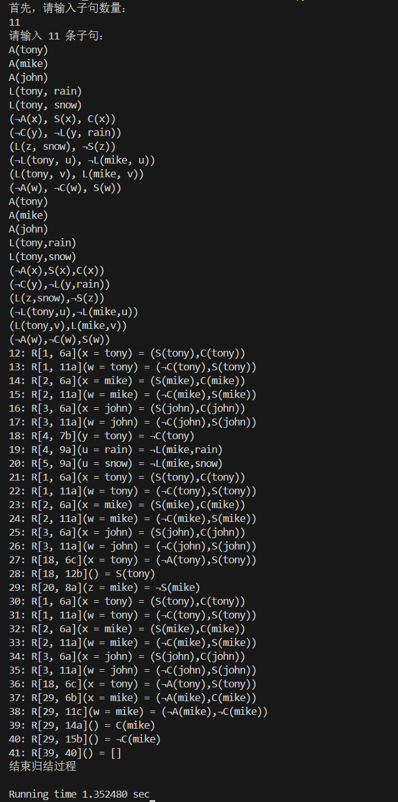
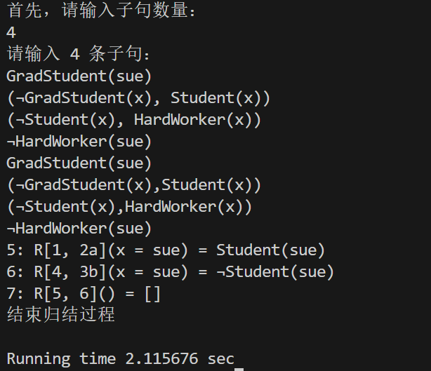

<font size = 4> <center>中山大学计算机学院 </font>
<font size = 4> 人工智能
本科生实验报告 </font>

<font size = 4> 课程名称：Artificial Intelligence </font>


</center>


<font size = 3><center>学号：22320131
姓名：韦百强 </center> </font>


# 一、 实验题目
利用归结推理的算法，实现对简单子句集的归结合并。

# 二、 实验内容

## 1. 算法原理

### 1. 一般合一算法：
合一（unifier）：
通过变量替换使得两个子句能够被归结（有相同的原子），所以合一也被定义为使得两个原子公式等价的一组变量替换/赋值
由于一阶逻辑中存在变量，所以归结之前需要进行合一，如(P(john),Q(fred),R(x))和(¬P(y),R(susan),R(y))两个子句中，我们无法找到一样的原子及其对应的否定，但是不代表它们不能够归结
通过将y替换为john，我们得到了(P(john),Q(fred),R(x))和(¬P(john),R(susan),R(john))，此时我们两个子句分别存在原子P(john)和它的否定¬P(john)，可以进行归结
最一般合一：指使得两个原子公式等价，最简单的一组变量替换

### 2. 归结算法：
将α取否定，加入到KB当中
将更新的KB转换为clausal form得到S
反复调用单步归结
如果得到空子句，即S|-()，说明KB ∧¬α 不可满足，算法终止，可得KB |= α
如果一直归结直到不产生新的子句，在这个过程中没有得到空子句，则KB |= α不成立

### 3. 利用合一算法逐步将子句合并，直到产生空子句

##  2. 关键代码展示

### 1. 归结的大致过程
```python
while status:
        for i in range(len(set_of_clause)):
            if not status: # 用于跳出多重循环
                break
            if len(set_of_clause[i]) == 1:  # set_of_clause[i]是只有一个谓词的子句
                for j in range(0, len(set_of_clause)):  # 找可使用规则 (A)and(¬A,B,C,...) => (B,C,...) 的子句set_of_clause(j)
                    if not status:   # 用于跳出多重循环
                        break
                    if i == j:  # 不能与自己进行消去
                        continue
                    prename = [] # 记录需要换名的变量
                    newname = []  # 记录换名后的变量
                    target = -1  # 记录可以消去的子句的位置
                    for k in range(len(set_of_clause[j])):  # 找到可以消去的子句
                        if set_of_clause[i][0].get_name() == set_of_clause[j][k].get_name() and set_of_clause[i][
                            0].get_pre() != set_of_clause[j][k].get_pre():
                            target = k
                            for l in range(len(set_of_clause[j][k].element) - 1):  # 找到可以换名的变量并记录
                                if len(set_of_clause[j][k].element[l + 1]) == 1:  # 是自由变量
                                    prename.append(set_of_clause[j][k].element[l + 1])
                                    newname.append(set_of_clause[i][0].element[l + 1])
                                # 是相同的变量
                                elif len(set_of_clause[i][0].element[l + 1]) == 1:
                                    prename.append(set_of_clause[i][k].element[l + 1])
                                    newname.append(set_of_clause[j][0].element[l + 1])
                                # 是不同的变量
                                elif set_of_clause[j][k].element[l + 1] != set_of_clause[i][0].element[l + 1]:
                                    target = -1
                                    break
                                
                            break
                    if target == -1:  # 没有找到可以消去的子句
                        continue
                    new_clause = []  # 记录生成的新子句
                    for k in range(len(set_of_clause[j])):
                        if k != target:  # 生成新子句
                            p = Predicate("")
                            p.new(set_of_clause[j][k].element)
                            p.rename(prename, newname)
                            new_clause.append(p)
                    if len(new_clause) == 1:  # 判断是否生成的子句是否与已有重复（不判断是否生成了子句）
                        for k in range(len(set_of_clause)):
                            if len(set_of_clause[k]) == 1 and new_clause[0].element == set_of_clause[k][0].element:
                                target = -1
                                break
                    if target == -1:  # 如果生成的子句已存在，跳过加入子句集的过程
                        continue
                    set_of_clause.append(new_clause)  # 生成的新的子句加入的子句集中
                    print_msg(target, i, j, prename, newname, set_of_clause)  # 输出生成新子句的相关信息
                    __print(new_clause)  # 输出该新子句
                    if end_or_not(new_clause, set_of_clause):  # 判断是否应该结束归结过程
                        status = False
                        break
            #  set_of_clause[i]是有多个谓词的子句
            else:  
                for j in range(0, len(set_of_clause)):  # 找可使用规则 (A,B,C,...)and(¬A,B,C,...) => (B,C,...) 的子句set_of_clause(j)
                    target = -1
                    if i != j and len(set_of_clause[i]) == len(set_of_clause[j]):
                        for k in range(len(set_of_clause[i])):
                            if set_of_clause[i][k].element == set_of_clause[j][k].element:
                                continue
                            elif set_of_clause[i][k].get_name() == set_of_clause[j][k].get_name() and set_of_clause[i][k].element[1:] == set_of_clause[j][k].element[1:]:
                                # 找到可以消去的子句
                                if target != -1:  # 表明已经存在一处不等的情况，无法使用该规则进行消除
                                    target = -1
                                    break
                                target = k
                            else:
                                target = -1
                                break
                    if target == -1:
                        continue
                    new_clause = []
                    for k in range(len(set_of_clause[i])):
                        if k != target:
                            p = Predicate("")
                            p.new(set_of_clause[j][k].element)
                            new_clause.append(p)
                    if len(new_clause) == 1:  # 判断是否生成的子句是否与已有重复（不判断是否生成了子句）
                        for k in range(len(set_of_clause)):
                            if len(set_of_clause[k]) == 1 and new_clause[0].element == set_of_clause[k][0].element:
                                target = -1
                                break
                    if target == -1:  # 如果生成的子句已存在，跳过加入子句集的过程
                        continue
                    set_of_clause.append(new_clause)
                    print_msg(target, i, j, [], [], set_of_clause)  # 输出生成新子句的相关信息
                    __print(new_clause)  # 输出该新子句
                    if end_or_not(new_clause, set_of_clause):  # 判断是否应该结束归结过程
                        status = False
                        break
```

### 2. 细节处理过程
```python
set_of_clause = []  # 存储子句集
    tmp = ""  # 用于拆分子句使用的中间变量
    for i in range(int(num_of_clause)):
        clause_input = input()  # 输入子句
        if clause_input[0] == '(':  # 去掉子句的左括号
            clause_input = clause_input[1: -1]
        
        clause_input = clause_input.replace(' ', '')  # 去掉子句中的空格
        set_of_clause.append([])  # 为子句集添加一个新的子句
        for cnt in range(len(clause_input)):  # 拆分存储在列表里
            tmp += clause_input[cnt] # 一个一个字符的拆分
            if clause_input[cnt] == ')':  # 遇到右括号，说明一个谓词结束
                if cnt + 1 != num_of_clause: # 如果不是最后一个谓词，加上逗号
                    clause_tmp = Predicate(tmp)  # 创造一个谓词公式类Predicate的变量
                    set_of_clause[i].append(clause_tmp)  # 加入到子句集的第i个子句中
                tmp = "" # 清空tmp

    for i in range(len(set_of_clause)):  # 输出子句
        __print(set_of_clause[i]) 
    status = True  # 用于判断是否结束归结过程
```

### 3. 测量归结时间，在main.py中
```python
    start = time.time()
    ResolutionFOL(num_of_clause)
    end = time.time()
    print('\nRunning time %.6f sec' % (end - start))
```

## 3. 创新点
其实并没有创新之处，甚至都没有完全实现最一般合一

# 三、	实验结果及分析

## 1. 实验结果展示示例

### 1. AIpine_Club



### 2. Graduate_Student


## 2. 评测指标展示及分析(运行时间)

### 1. AIpine_Club------1.352480sec
### 2. Graduate_Student------2.115676sec

*ps：不懂为何明显归结步骤少的花的时间更多*

# 四、 参考资料

1. 人工智能——基于谓词逻辑的归结原理https://blog.csdn.net/m0_60090611/article/details/129953593?spm=1001.2014.3001.5506
2. 合一算法的Python实现--人工智能https://blog.csdn.net/Zhangguohao666/article/details/105571115?spm=1001.2014.3001.5506

